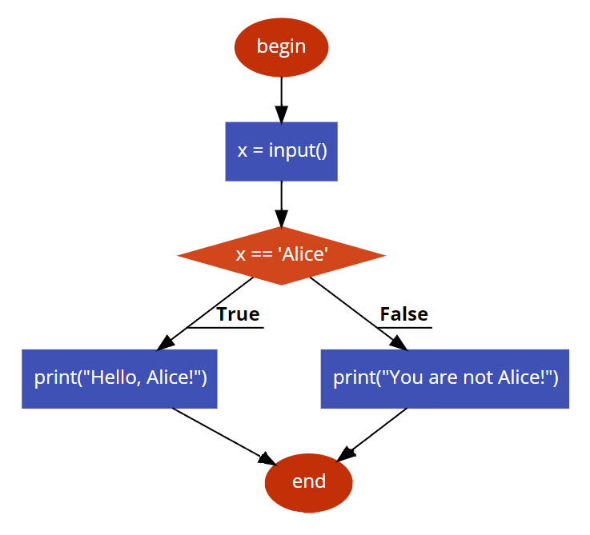
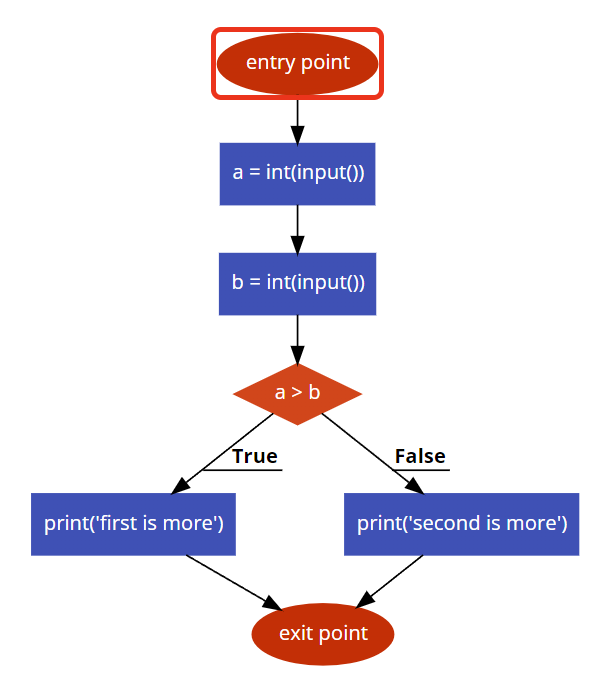

# Short and simple example

Let's assume, you have a Python program:

```python
x = input()
if x == 'Alice':
    print("Hello, Alice!")
else:
    print("You are not Alice!")
```

Then, you represent it as a Control Flow Graph:



Then, you create an XML representation of the program, in our format in `input.xml`:

```xml
<Graph>
    <vertices>
        <vertices>
            <objectsToRead/>
            <objectsToWrite/>
            <executionTime>
                <EO>0</EO>
                <RUST>0</RUST>
            </executionTime>
            <childIds>
                <childIds>1</childIds>
            </childIds>
        </vertices>
        <vertices>
            <objectsToRead/>
            <objectsToWrite>
                <objectsToWrite>0</objectsToWrite>
            </objectsToWrite>
            <executionTime>
                <EO>50</EO>
                <RUST>100</RUST>
            </executionTime>
            <childIds>
                <childIds>2</childIds>
            </childIds>
        </vertices>
        <vertices>
            <objectsToRead>
                <objectsToRead>0</ojectsToRead>
            </objectsToRead>
            <objectsToWrite/>
            <executionTime>
                <EO>20</EO>
                <RUST>10</RUST>
            </executionTime>
            <childIds>
                <childIds>3</childIds>
                <childIds>4</childIds>
            </childIds>
        </vertices>
        <vertices>
            <objectsToRead/>
            <objectsToWrite/>
            <executionTime>
                <EO>500</EO>
                <RUST>200</RUST>
            </executionTime>
            <childIds>
                <childIds>5</childIds>
            </childIds>
        </vertices>
        <vertices>
            <objectsToRead/>
            <objectsToWrite/>
            <executionTime>
                <EO>500</EO>
                <RUST>200</RUST>
            </executionTime>
            <childIds>
                <childIds>5</childIds>
            </childIds>
        </vertices>
        <vertices>
            <objectsToRead/>
            <objectsToWrite/>
            <executionTime>
                <EO>0</EO>
                <RUST>0</RUST>
            </executionTime>
            <childIds />
        </vertices>
    </vertices>
    <objectWeight>
        <objectWeight>400</objectWeight>
    </objectWeight>
</Graph>
```

Then, you install JDK and Maven. Then, clone this repository and build a JAR:

```bash
mvn package
```

Then, you run our tool:

```bash
mvn exec:java -Dexec.mainClass="alpha_algorithm.Main" -Dexec.args="--input input.xml --output result.json --alpha 1 --beta 1 --gamma 0.8"
```

You will get a new `result.json` file, like this:

```json
[
    {"vertices":[2,3,4]}
]
```

This means that the code fragment, matched with this code frgment from source program

```py
if x == 'Alice':
    print("Hello, Alice!")
else:
    print("You are not Alice!")
```

should be transformed to code in C++. In this case, the program will run faster.

_You can read more about what happened here and why it was done in the sections below._

# Abstract

Сonsider programming language that supports a [foreign function interface (FFI)](https://levelup.gitconnected.com/what-is-ffi-foreign-function-interface-an-intuitive-explanation-7327444e347a). The algorithm was originally developed for the EO and Rust languages, however, it can be applied to other programming languages as well. To simplify example, consider python, which supports executing C++ code with FFI. Note that some code fragments are executed faster in python, others in C++. This algorithm tries to speed up an execution of programs by using FFI.

# What the algorithm do?

The developed algorithm ($\alpha$-algorithm) takes as input:

* path to special `.xml` file based on the source code, which assumed to be optimized.

* path to `.json` file, in which the algorithm outputs information about the necessary transformations in a special format.

Currently, the construction of a special `.xml` file, as well as performing transformations in accordance with a special `.json` file, is done manually. But in the future, utilities will be developed that allow these processes to be performed automatically.

# A guide on using the algorithm

This section shows how to build an input file for the algorithm using the source code of the program.

## Creating a file with input data

Firstly, you need to create a file with the input data for the algorithm to work. Let the source code of the program to optimize be in the `main` file, and the input file for the algorithm is `input.xml`.

1) The source code of the program from `main` must be broken down into separate fragments. There is no clear limit to how small that fragments should be, but the smaller they are, the better program will be optimized. There is only one restriction: if more than one operation can be performed after a fragment is executed, then the fragment must include either all of these operations or none of them. As example, this part of code can be placed in one fragment:

```py
if a > b:
    print('first is more')
else:
    print('second is more')
```

but this can not be:

```py
if a > b:
    print('first is more')
```
The simplest option to break down program on separate fragments is split code according to [code2flow](https://app.code2flow.com/).

For example, for program

```py
a = int(input())
b = int(input())
if a > b:
    print('first number is more')
else:
    print('second number is more')
```

Correct breaking down on fragments are:

```py
a = int(input()) # fragment 1
b = int(input()) # fragment 2
if a > b: # fragment 3 (note, that if-else is one construction)
    print('first number is more') # fragment 4
else: # fragment 3 (note, that if-else is one construction)
    print('second number is more') # fragment 5
```

or

```py
a = int(input()) # fragment 1
b = int(input()) # fragment 1
if a > b: #fragment 2
    print('first number is more') # fragment 2
else: # fragment 2
    print('second number is more') # fragment 2
```

2) After that, add a dummy fragment for entry point operation and one or more dummy fragments for exit point operations.
    
3) Number all the fragments starting from 0, and the value 0 should be for the fragment corresponding to the dummy fragment for the entry point. Number matched to fragment - its ID.

    Example:

    * fragment 0: entry point
    * fragment 1:
    ```py
    a = int(input())
    ```
    * fragment 2:
    ```py
    b = int(input())
    ```
    * fragment 3:
    ```py
    if a > b:
    else
    ```
    * fragment 4:
    ```py
    print('first is more`)
    ```
    * fragment 5:
    ```py
    print('second is more')
    ```
    * fragment 6: exit point

    Also, that fragments represent a [control flow graph (CFG)](https://www.geeksforgeeks.org/software-engineering-control-flow-graph-cfg/) of this program.

    It can be visualised:

    

4) Create `input.xml` file and copy this template there:

```xml
<Graph>
    <vertices>
		
    </vertices>
    <objectWeight>
		
    </objectWeight>
    <prohibitedToTransform>

    </prohibitedToTransform>
</Graph>
```

5) In the file `input.xml `in the `<vertices>` tag, for each fragment in order of increasing fragment ID, add this tag:

    ```xml
    <vertices>
        <childIds>
            
        </childIds>
    </vertices>
    ```

    For example, for break down from 4, `input.xml` file will be:

    ```xml
    <Graph>
        <vertices>
            <vertices>
                <childIds>
                    
                </childIds>
            </vertices>
            <vertices>
                <childIds>
                    
                </childIds>
            </vertices>
            <vertices>
                <childIds>
                    
                </childIds>
            </vertices>
            <vertices>
                <childIds>
                    
                </childIds>
            </vertices>
            <vertices>
                <childIds>
                    
                </childIds>
            </vertices>
            <vertices>
                <childIds>
                    
                </childIds>
            </vertices>
            <vertices>
                <childIds>
                    
                </childIds>
            </vertices>
        </vertices>
        <objectWeight>
            
        </objectWeight>
        <prohibitedToTransform>

        </prohibitedToTransform>
    </Graph>
    ```

6) For each fragment, in its `<childIds>` tag, should be placed IDs of fragments, which can be executed after the specified fragment is executed. Each such ID is specified in a separate `<childIds>` tag, nested in the `<childIds>` tag of the corresponding fragment. If a fragment has no child fragments, then its tag `<childIds>` should be specified as follows: `<childIds \>`.

    For example, for break down from 4, `input.xml` will be:

    ```xml
    <Graph>
        <vertices>
            <vertices>
                <childIds>
                    <childIds>1</childIds>
                </childIds>
            </vertices>
            <vertices>
                <childIds>
                    <childIds>2</childIds>
                </childIds>
            </vertices>
            <vertices>
                <childIds>
                    <childIds>3</childIds>
                </childIds>
            </vertices>
            <vertices>
                <childIds>
                    <childIds>4</childIds>
                    <childIds>5</childIds>
                </childIds>
            </vertices>
            <vertices>
                <childIds>
                    <childIds>6</childIds>
                </childIds>
            </vertices>
            <vertices>
                <childIds>
                    <childIds>6</childIds>
                </childIds>
            </vertices>
            <vertices>
                <childIds />
            </vertices>
        </vertices>
        <objectWeight>
            
        </objectWeight>
        <prohibitedToTransform>

        </prohibitedToTransform>
    </Graph>
    ```

7) In `input.xml`, for each fragment add this tag:

    ```xml
    <executionTime>
        <EO></EO>
        <RUST></RUST>
    </executionTime>
    ```

    In `<EO>` tag, specify the labor costs for performing the operation in the main language (in our case python) in conventional units corresponding to this code fragment. Similarly, in `<RUST>` tag, specify the labor costs for performing the operation in the FFI language (in our case c++) in conditional units corresponding to this code fragment.

    The labor cost of performing an operation in conventional units for each fragment of code can be calculated experimentally, using time measurements or the number of processor cycles.
    
    As example, for break down from 4, `input.xml` will be:

    ```xml
    <Graph>
        <vertices>
            <vertices>
                <executionTime>
                    <EO>0</EO>
                    <RUST>0</RUST>
                </executionTime>
                <childIds>
                    <childIds>1</childIds>
                </childIds>
            </vertices>
            <vertices>
                <executionTime>
                    <EO>50</EO>
                    <RUST>100</RUST>
                </executionTime>
                <childIds>
                    <childIds>2</childIds>
                </childIds>
            </vertices>
            <vertices>
                <executionTime>
                    <EO>50</EO>
                    <RUST>100</RUST>
                </executionTime>
                <childIds>
                    <childIds>3</childIds>
                </childIds>
            </vertices>
            <vertices>
                <executionTime>
                    <EO>75</EO>
                    <RUST>200</RUST>
                </executionTime>
                <childIds>
                    <childIds>4</childIds>
                    <childIds>5</childIds>
                </childIds>
            </vertices>
            <vertices>
                <executionTime>
                    <EO>200</EO>
                    <RUST>100</RUST>
                </executionTime>
                <childIds>
                    <childIds>6</childIds>
                </childIds>
            </vertices>
            <vertices>
                <executionTime>
                    <EO>200</EO>
                    <RUST>100</RUST>
                </executionTime>
                <childIds>
                    <childIds>6</childIds>
                </childIds>
            </vertices>
            <vertices>
                <executionTime>
                    <EO>0</EO>
                    <RUST>0</RUST>
                </executionTime>
                <childIds />
            </vertices>
        </vertices>
        <objectWeight>
            
        </objectWeight>
        <prohibitedToTransform>

        </prohibitedToTransform>
    </Graph>
    ```

8) Select all the objects in the program in `main`, and assign a number to each of them, starting with 0 - ID.

    As example, for break down from 4, object IDs will be:

    * a - 0
    * b - 1

    If you are working with a programming language that has primitive types, then consider variables of these primitive types to be objects too. In the vast majority of cases, all objects of the same container should be considered one object.

9) For each object from program in `main`, in `<objectWeight>` tag, add 

    ```xml
    <objectWeight>X</objectWeight>
    ```

    where X - maximum possible weight of this object in bytes.

    For break down from 4, `input.xml` will be:

    ```xml
    <Graph>
        <vertices>
            <vertices>
                <executionTime>
                    <EO>0</EO>
                    <RUST>0</RUST>
                </executionTime>
                <childIds>
                    <childIds>1</childIds>
                </childIds>
            </vertices>
            <vertices>
                <executionTime>
                    <EO>50</EO>
                    <RUST>100</RUST>
                </executionTime>
                <childIds>
                    <childIds>2</childIds>
                </childIds>
            </vertices>
            <vertices>
                <executionTime>
                    <EO>50</EO>
                    <RUST>100</RUST>
                </executionTime>
                <childIds>
                    <childIds>3</childIds>
                </childIds>
            </vertices>
            <vertices>
                <executionTime>
                    <EO>75</EO>
                    <RUST>200</RUST>
                </executionTime>
                <childIds>
                    <childIds>4</childIds>
                    <childIds>5</childIds>
                </childIds>
            </vertices>
            <vertices>
                <executionTime>
                    <EO>200</EO>
                    <RUST>100</RUST>
                </executionTime>
                <childIds>
                    <childIds>6</childIds>
                </childIds>
            </vertices>
            <vertices>
                <executionTime>
                    <EO>200</EO>
                    <RUST>100</RUST>
                </executionTime>
                <childIds>
                    <childIds>6</childIds>
                </childIds>
            </vertices>
            <vertices>
                <executionTime>
                    <EO>0</EO>
                    <RUST>0</RUST>
                </executionTime>
                <childIds />
            </vertices>
        </vertices>
        <objectWeight>
            <objectWeight>4</objectWeight>
            <objectWeight>4</objectWeight>
        </objectWeight>
        <prohibitedToTransform>

        </prohibitedToTransform>
    </Graph>
    ```

10) In `input.xml` for each fragment, add `<objectsToRead>` tag add `<objectsToRead>` tag for each object ID, which is used in this code fragment, but are not modified. Also, for each fragment, add `<objectsToWrite>` tag add `<objectsToWrite>` tag for each object ID, which is used in this code fragment and modified.

    For example, for break down 4, `input.xml` will be:

    ```xml
    <Graph>
        <vertices>
            <vertices>
            	<objectsToRead/>
			    <objectsToWrite/>
                <executionTime>
                    <EO>0</EO>
                    <RUST>0</RUST>
                </executionTime>
                <childIds>
                    <childIds>1</childIds>
                </childIds>
            </vertices>
            <vertices>
                <objectsToRead/>
                <objectsToWrite>
                    <objectsToWrite>0</objectsToWrite>
                </objectsToWrite>
                <executionTime>
                    <EO>50</EO>
                    <RUST>100</RUST>
                </executionTime>
                <childIds>
                    <childIds>2</childIds>
                </childIds>
            </vertices>
            <vertices>
                <objectsToRead/>
                <objectsToWrite>
                    <objectsToWrite>1</objectsToWrite>
                </objectsToWrite>
                <executionTime>
                    <EO>50</EO>
                    <RUST>100</RUST>
                </executionTime>
                <childIds>
                    <childIds>3</childIds>
                </childIds>
            </vertices>
            <vertices>
                <objectsToRead>
                    <objectsToRead>0</objectsToRead>
                    <objectsToRead>1</objectsToRead>
                </objectsToRead>
                <objectsToWrite/>
                <executionTime>
                    <EO>75</EO>
                    <RUST>200</RUST>
                </executionTime>
                <childIds>
                    <childIds>4</childIds>
                    <childIds>5</childIds>
                </childIds>
            </vertices>
            <vertices>
                <objectsToRead/>
                <objectsToWrite/>
                <executionTime>
                    <EO>200</EO>
                    <RUST>100</RUST>
                </executionTime>
                <childIds>
                    <childIds>6</childIds>
                </childIds>
            </vertices>
            <vertices>
                <objectsToRead/>
                <objectsToWrite/>
                <executionTime>
                    <EO>200</EO>
                    <RUST>100</RUST>
                </executionTime>
                <childIds>
                    <childIds>6</childIds>
                </childIds>
            </vertices>
            <vertices>
                <objectsToRead/>
                <objectsToWrite/>
                <executionTime>
                    <EO>0</EO>
                    <RUST>0</RUST>
                </executionTime>
                <childIds />
            </vertices>
        </vertices>
        <objectWeight>
            <objectWeight>4</objectWeight>
            <objectWeight>4</objectWeight>
        </objectWeight>
        <prohibitedToTransform>

        </prohibitedToTransform>
    </Graph>
    ```

11) In `input.xml` in `<prohibitedToTransform>` tag add `<prohibitedToTransform>` for all fragment IDs, fragments corresponding to which can not be transformed to FFI language. In our example, there's no such fragments.

12) If somewhere in `input.xml` exist tag with empty body (`<A><A/>`), it should be replaced on `<A />`.

13) Finally, we have made a file with the input data `input.xml`:

    ```xml
        <Graph>
            <vertices>
                <vertices>
                    <objectsToRead/>
                    <objectsToWrite/>
                    <executionTime>
                        <EO>0</EO>
                        <RUST>0</RUST>
                    </executionTime>
                    <childIds>
                        <childIds>1</childIds>
                    </childIds>
                </vertices>
                <vertices>
                    <objectsToRead/>
                    <objectsToWrite>
                        <objectsToWrite>0</objectsToWrite>
                    </objectsToWrite>
                    <executionTime>
                        <EO>50</EO>
                        <RUST>100</RUST>
                    </executionTime>
                    <childIds>
                        <childIds>2</childIds>
                    </childIds>
                </vertices>
                <vertices>
                    <objectsToRead/>
                    <objectsToWrite>
                        <objectsToWrite>1</objectsToWrite>
                    </objectsToWrite>
                    <executionTime>
                        <EO>50</EO>
                        <RUST>100</RUST>
                    </executionTime>
                    <childIds>
                        <childIds>3</childIds>
                    </childIds>
                </vertices>
                <vertices>
                    <objectsToRead>
                        <objectsToRead>0</objectsToRead>
                        <objectsToRead>1</objectsToRead>
                    </objectsToRead>
                    <objectsToWrite/>
                    <executionTime>
                        <EO>75</EO>
                        <RUST>200</RUST>
                    </executionTime>
                    <childIds>
                        <childIds>4</childIds>
                        <childIds>5</childIds>
                    </childIds>
                </vertices>
                <vertices>
                    <objectsToRead/>
                    <objectsToWrite/>
                    <executionTime>
                        <EO>200</EO>
                        <RUST>100</RUST>
                    </executionTime>
                    <childIds>
                        <childIds>6</childIds>
                    </childIds>
                </vertices>
                <vertices>
                    <objectsToRead/>
                    <objectsToWrite/>
                    <executionTime>
                        <EO>200</EO>
                        <RUST>100</RUST>
                    </executionTime>
                    <childIds>
                        <childIds>6</childIds>
                    </childIds>
                </vertices>
                <vertices>
                    <objectsToRead/>
                    <objectsToWrite/>
                    <executionTime>
                        <EO>0</EO>
                        <RUST>0</RUST>
                    </executionTime>
                    <childIds />
                </vertices>
            </vertices>
            <objectWeight>
                <objectWeight>4</objectWeight>
                <objectWeight>4</objectWeight>
            </objectWeight>
            <prohibitedToTransform>

            </prohibitedToTransform>
        </Graph>
    ```

_Note: in the future, a special utility will be developed that will allow you to automatically build an .xml file with input data, based on the source code._

## Installing a module for code optimization.

This section describes how to start a project and use it to get a set of code fragments that need to be converted.

1) Clone this repository;

2) Install [JDK](https://www.oracle.com/java/technologies/javase/jdk19-archive-downloads.html);

3) [Install maven](https://maven.apache.org/install.html);

4) To build:

    ```bash
    cd code\alpha_algorithm
    mvn package
    ```

5) To run:

    ```bash
    mvn exec:java -Dexec.mainClass="alpha_algorithm.Main" -Dexec.args="--input input.xml --output result.json --alpha 1 --beta 1 --gamma 0.8"
    ```

    Where `input.xml` is the path to file with input data, written in the previous section, and `result.json` is the path to the file where the algorithm outputs the data. `alpha`, `beta` and `gamma` are algorithm hyperparameters. `input` and `output` params are required, while `alpha`, `beta` and `gamma` are optional params.

    The value of `alpha` corresponds to constant part of labor cost of transporting data to fragment of code, transformed to FFI language.

    The value of `beta` corresponds to linear part of labor cost of transporting data to fragment of code, depending on summarized weight of objects in code fragment, transformed to FFI language.

    The value of `gamma` corresponds to regularization factor. If `gamma` equals 1, then there's no regularization. If gamma equals 1, there's no regularization. If `gamma `$\in (0;1)$, then regularization is used.

    Default values: `alpha=1.01`, `beta=1.0`, `gamma=0.8`.

## Performing transformations in accordance with the result of the algorithm

After the algorithm is running, the `result.json` file will look like:

```json
[
    {"vertices":[4,5,6]}
]
```

Each `"vertices"` means that all the elements corresponding to this list should be converted together as a single code insertion into the FFI language.

The algorithm guarantees that it is possible to perform all the transformations specified by it, provided that the input data was specified correctly.

Apply the transformations specified by the algorithm and there be will be gotten:

```cpp
// File libcompare.cpp
#include <iostream>

void compare(int a, int b)
{
    if (a > b) {
        std::cout << "first is more";
    } else {
        std::cout << "second is more";
    }
}

extern "C"
{
    extern void cffi_compare(int a, int b)
    {
        return compare(a, b);
    }
}
```

```py
# File main.py
import cffi

ffi = cffi.FFI()
ffi.cdef("void cffi_compare(int a, int b);")
C = ffi.dlopen("./libcompare.so")

a = int(input())
b = int(input())
C.cffi_compare(a, b)
```

```sh
# File go.sh
set -e

[ -z "$PYTHON" ] && PYTHON="python"

g++ -o ./libcompare.so ./libcompare.cpp -fPIC -shared
python main.py
```

To execute program, just run `go.sh`.

_Note: in the future, a special utility will be developed that will automatically perform transformations based on the source code `main` and the `result.json` file, returned by the algorithm._

In this example, the execution times of code fragments that do not correspond to reality were taken. But if they were true, then as a result of the above actions, the execution time of the program would be accelerated approximately by 20%.
