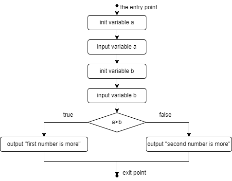
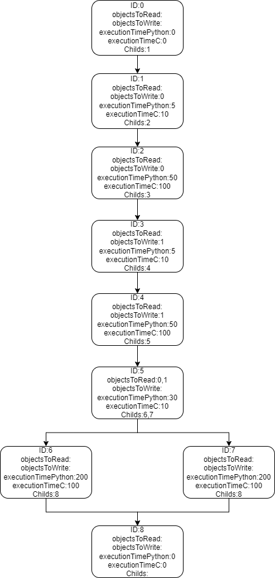

# The algorithm of algorithmization

Сonsider programming language that supports a [foreign function interface (FFI)](https://levelup.gitconnected.com/what-is-ffi-foreign-function-interface-an-intuitive-explanation-7327444e347a). The algorithm was originally developed for the EO and Rust languages. But to simplify example, consider python, which supports executing C++ code with FFI. Note that some code fragments are executed faster in python, others in C++. This algorithm tries to speed up an execution of program by using FFI.

Take an example. Try to speed up execution of such a python program:

```py
a = int(input())
b = int(input())
if a > b:
    print('first number is more')
else:
    print('second number is more')
```

This program corresponds to such a [control flow graph](https://www.geeksforgeeks.org/software-engineering-control-flow-graph-cfg/):



The program also contains objects. Set ID to each object. $a_{ID}=0,b_{ID}=1$.

Also, each vertex of control flow graph contains information about code fragment, matched with this vertex. Look at example:



Each vertex contains:
* ID;
* List of ID's of objects, which are not modified, but used in code fragment, matched with vertex;
* List of ID's of objects, which are modified in code fragment, matched with vertex;
* Execution time of code fragment in vertex on original language (in conventional units);
* Execution time of code fragment in vertex on FFI language (in conventional units);
* List of ID's of child vertices.

The input data for the algorithm is provided as an .xml file, here is an example: [here](test_examples/test_simple.xml).

Detailed explanation:

\<Graph> contains explanation of control flow graph. In vertex description there's no <ID> tag: vertices are numerated by ID in vertices list (firstly specified vertex with ID=0, after vertex with ID=1, etc.)

All objects of program specified in \<objectWeight>. For all objects should be specified only object weight. Firstly, specify weight of object with ID=0, after that weight of object with ID=1, etc.

The algorithm receives the .xml file described above as input, and outputs a [.json file like this](test_examples/result_simple.json).

How this algorithm works is [here](algorithm_description.md).

Each "vertices" list - set of IDs of vertices, code fragments matched with which should be converted to FFI language as one code block. For this example, algorithm returned [5,6,7], so code fragments, matched with these vertices, should be converted to C++. Algorithm returns only .json, but if these code fragments will be converted with using FFI will be gotten:

```cpp
// File compare.h
#include <iostream>

void compare(int a, int b) {
    if (a > b) {
        std::cout << "first number is more";
    } else {
        std::cout << "second number is more";
    }
}
```

```py
# File main.py
import cffi
import pathlib

ffi = cffi.FFI()
this_dir = pathlib.Path().absolute()
h_file_name = this_dir / "compare.h"
with open(h_file_name) as h_file:
    ffi.cdef(h_file.read())

a = int(input())
b = int(input())
ffi.lib.compare(a, b)
```

In this example, the execution times of code fragments that do not correspond to reality were taken. But if they were true, then as a result of the above actions, the execution time of the program would be accelerated approximately by 40%.
