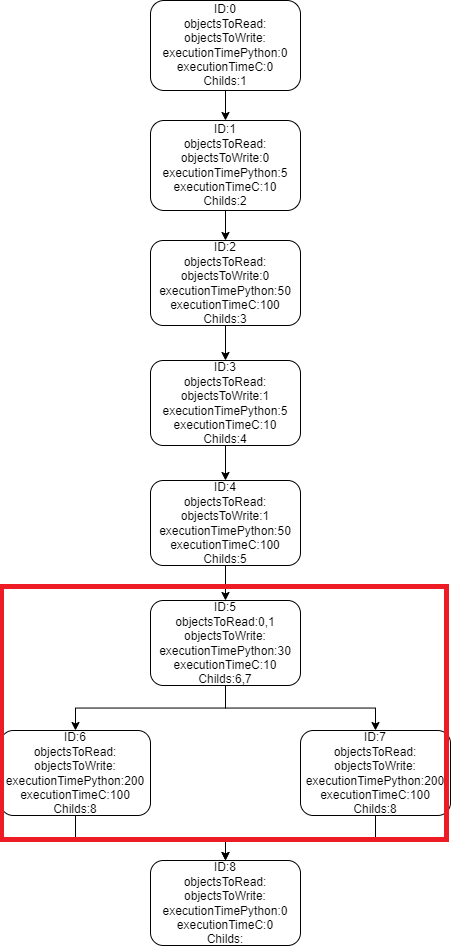

# The algorithm description

Consider the operation of the algorithm using the example of this program and its control-flow graph:

```py
a = int(input())
b = int(input())
if a > b:
    print('first number is more')
else:
    print('second number is more')
```


## Preprocessing

* Algorithm calculates vertices, which are included in any loop of CFG and stores them in _verticesInLoops_ set (for control-flow graph from example, there's no loops);

* Algorithm calculates _objectsUsedInDescendants_ - array of sets, _objectsUsedInDescendants_[i] - set of all objects, concluded in vtx_read and vtx_write of all descendants of vertex i (excluding vertex i). For CFG from example, _objectsUsedInDescendants_:

[

    [a, b],

    [a, b],

    [a, b],

    [a, b],

    [a, b],

    [a, b],
    
    [],
    
    [],
    
    []
]

* Algorithm calculates _fragmentRequirements_ - array of sets. Each set conclude vertices, which should be executed on one programming language. For each vertex $v$, if $v$ has more than one child, then to _fragmentRequirements_ adds $v$ and all childs of $v$. For CFG from example, _fragmentRequirements_:

[

    [5, 6, 7]

]



* Builds reversed CFG. That is CFG, but each edge is directed in the opposite direction.

## The algorithm:

1) Algorithm finds all code fragments, which can be optimized. Code fragment - subset of vertices of CFG, which starts from vertex _start_ and ends vertex _finish_, which is descendant of _start_. Fragment - set of all vertices, which conclude any simple path from _start_ to _finish_. Algorithm goes through all such fragments and looks at them and selects only those that:

    * Among all vertices from the fragment which starts from _start_ and finishs in _finish_ vertex, no one vertex except _start_ has incoming edge from _vertex_ not from this fragment;

    * Among all vertices from the fragment which starts from _starts_ and finishs in _finish_ vertex, no one vertex exceprt _finish_ has outcoming edge to vertex not from this fragment (except leafs);

    * For all requirement from _fragmnetRequirements_, this fragment contains all vertices from current requirement, or contains no one vertex from current requirement;

    * vertex, matches the program entry point not in current fragment;

    * current fragment contains no one leaf.

    * Profit of transorming code, matches all vertices from this fragment, is positive. Profit - the expectation of how much the laboriousness of executing the program will decrease if the current code fragment is transformed into Rust. It's equal [EO execution laboriousness] - [Rust execution laboriousness] - [laboriousness of transporting data to current fragment] - [laboriousness of exporting data from fragment]. 
        * [EO execution laboriousness] - sum of EO execution laboriousness by all vertices from current fragment.

        * [Rust execution laboriousness] - sum of Rust execution laboriousness by all vertices from current fragment.

        * [laboriousness of transporting data from current fragment] - counts summary weight (sw) of objects in intersection of objects, concluded in vtx_read and ctx_write in current fragment and objects, previously used before start vertex. Finally, [laboriousness of transporting data to current fragment] equals $\alpha$ + sw * $\beta$, where $\alpha$ and $\beta$ are hyperparams. Additionaly, if current fragment concludes any vertex from _verticesInLoops_, value of [laboriousness of transporting data to current fragment] multiplied on hyper-param $\gamma$.

        * [laboriousness of transporting data from current fragment] - counts summary weight (sw) of objects in intersection of objects, concluded in vtx_read and ctx_write in current fragment and objects from _objectsUsedInDescendants_. Finally, [laboriousness of transporting data from current fragment] equals $\alpha$ + sw * $\beta$, where $\alpha$ and $\beta$ are hyperparams. Additionaly, if current fragment concludes any vertex from _verticesInLoops_, value of [laboriousness of transporting data to current fragment] multiplied on hyper-param $\gamma$.

For CFG from example, algorithm will find these fragments and their profit:

[

    (5,6,7), # profit 211

    (4,5,6,7), # profit 157

    (3,4,5,6,7), # profit 152

    (2,3,4,5,6,7), # profit 102

    (1,2,3,4,5,6,7), # profit 97

]

2) After that algorithm builds clique Graph. It contains fragments, fragment A is connected to fragment B in this clique graph if $\exists v: v\in A \wedge v \in B$.

After that, algorithm finds [maximal clique](https://dl.acm.org/doi/abs/10.5555/61990) of clique graph, and returns fragments, which are included clique, summary profit vertices of which is the most possible.