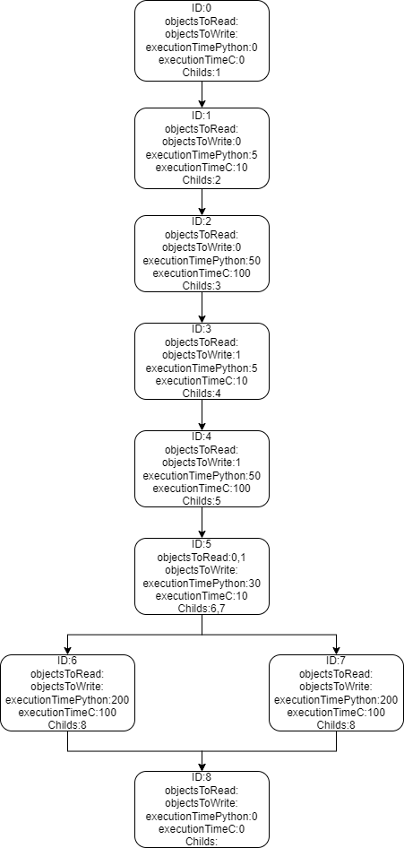

# How to build control flow graph (CFG)

In the future, a special utility for the EO language will be developed, with which it will be possible to quickly and easily build CFG from the source code. But already now you can build a CFG using [code2flow](https://app.code2flow.com/).

The program also contains objects. Set ID to each object. $a_{ID}=0,b_{ID}=1$.

Also, each vertex of control flow graph contains information about code fragment, matched with this vertex. Look at example:

Each vertex contains:
* ID;
* List of ID's of objects, which are not modified, but used in code fragment, matched with vertex;
* List of ID's of objects, which are modified in code fragment, matched with vertex;
* Execution time of code fragment in vertex on original language (in conventional units);
* Execution time of code fragment in vertex on FFI language (in conventional units);
* List of ID's of child vertices.

The input data for the algorithm is provided as an .xml file, here is an example: [here](test_examples/test_simple.xml).

Detailed explanation:

\<Graph> contains explanation of control flow graph. In vertex description there's no <ID> tag: vertices are numerated by ID in vertices list (firstly specified vertex with ID=0, after vertex with ID=1, etc.)

All objects of program specified in \<objectWeight>. For all objects should be specified only object weight. Firstly, specify weight of object with ID=0, after that weight of object with ID=1, etc.